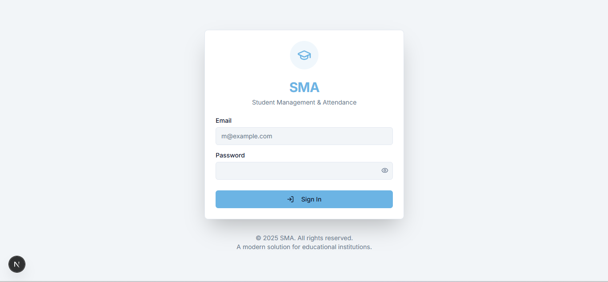
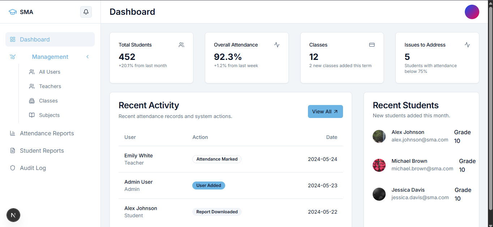
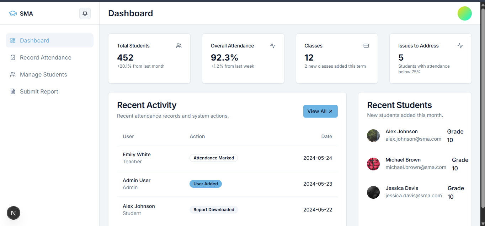
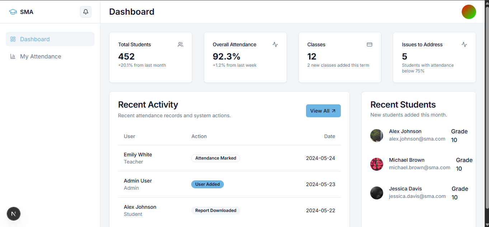

<div align="center">

# 🎓 SMA - Student Management & Attendance



### A Modern, Secure, and AI-Powered School Management System

[](https://nextjs.org/)
[](https://reactjs.org/)
[](https://www.typescriptlang.org/)
[](https://tailwindcss.com/)
[](https://firebase.google.com/)

</div>

---

## 📋 Table of Contents

- [Overview](#-overview)
- [Features](#-features)
- [Screenshots](#-screenshots)
- [Tech Stack](#-tech-stack)
- [Project Structure](#-project-structure)
- [Getting Started](#-getting-started)
- [Environment Configuration](#-environment-configuration)
- [Authentication System](#-authentication-system)
- [Role-Based Access Control](#-role-based-access-control)
- [AI-Powered Features](#-ai-powered-features)
- [Security Considerations](#-security-considerations)
- [Deployment](#-deployment)
- [Contributing](#-contributing)
- [License](#-license)

---

## 🌟 Overview

**SMA (Student Management & Attendance)** is a comprehensive, full-stack web application designed for educational institutions to efficiently manage student attendance, track academic performance, and streamline administrative tasks. Built with modern technologies like Next.js 15, React 19, and TypeScript, it provides a secure, scalable, and user-friendly platform for administrators, teachers, and students.

The application features a **custom JWT-based authentication system** that doesn't rely on external OAuth providers, giving you complete control over your authentication infrastructure. It also integrates **Genkit AI** for intelligent attendance insights and pattern analysis.

---

## ✨ Features

### 🔐 **Authentication & Security**
- Custom JWT-based authentication system
- Secure HTTP-only cookie management
- Role-based middleware protection
- Password visibility toggle for better UX

### 👨‍💼 **Admin Dashboard**
- Complete user management (CRUD operations)
- Teacher and student account administration
- Class and subject management
- Comprehensive audit logging
- System-wide reports and analytics
- Student performance reports

### 👩‍🏫 **Teacher Portal**
- Attendance marking interface
- Student list management per class
- Class-wise attendance reports
- Quick attendance status overview

### 👨‍🎓 **Student Portal**
- Personal attendance overview
- Attendance history and statistics
- Subject-wise attendance breakdown

### 🤖 **AI-Powered Analytics**
- Genkit AI integration for attendance insights
- Pattern recognition in student attendance
- Automated anomaly detection
- Actionable intervention suggestions

### 🎨 **Modern UI/UX**
- Responsive design for all devices
- Dark/Light mode support
- Beautiful Radix UI components
- Smooth animations with Tailwind
- Interactive charts with Recharts

---

## 📸 Screenshots

### 🔐 Authentication Page
<div align="center">

</div>

*Clean and modern login interface with password visibility toggle and form validation.*

---

### 👨‍💼 Admin Dashboard
<div align="center">

</div>

*Comprehensive admin dashboard with navigation sidebar, user management, and quick access to all administrative functions.*

---

### 👩‍🏫 Teacher Dashboard
<div align="center">

</div>

*Teacher interface for managing classes, marking attendance, and viewing student reports.*

---

### 👨‍🎓 Student Dashboard
<div align="center">

</div>

*Student view showing personal attendance records, statistics, and subject-wise breakdown.*

---

## 🛠️ Tech Stack

### **Frontend**
| Technology | Purpose |
|------------|---------|
| **Next.js 15** | React framework with App Router & Turbopack |
| **React 19** | UI component library |
| **TypeScript 5** | Type-safe development |
| **TailwindCSS 3.4** | Utility-first CSS framework |
| **Radix UI** | Accessible component primitives |
| **Lucide Icons** | Beautiful icon library |
| **Recharts** | Data visualization |

### **Backend & Authentication**
| Technology | Purpose |
|------------|---------|
| **Next.js API Routes** | Backend API endpoints |
| **JWT (jsonwebtoken)** | Token-based authentication |
| **HTTP-only Cookies** | Secure session management |
| **Custom Middleware** | Route protection & RBAC |

### **AI & Data**
| Technology | Purpose |
|------------|---------|
| **Genkit AI** | AI-powered attendance insights |
| **Google GenAI** | Machine learning integration |
| **Zod** | Schema validation |

### **Additional Libraries**
| Technology | Purpose |
|------------|---------|
| **React Hook Form** | Form handling |
| **date-fns** | Date manipulation |
| **class-variance-authority** | Component variants |
| **Embla Carousel** | Carousel functionality |

---

## 📁 Project Structure

```
School Management app/
├── 📁 src/
│   ├── 📁 ai/                          # AI/ML Integration
│   │   ├── 📄 genkit.ts                # Genkit configuration
│   │   ├── 📄 dev.ts                   # Development server
│   │   └── 📁 flows/
│   │       └── 📄 generate-attendance-insights.ts  # AI insights flow
│   │
│   ├── 📁 api/                         # API routes (if external)
│   │
│   ├── 📁 app/                         # Next.js App Router
│   │   ├── 📄 page.tsx                 # Login page
│   │   ├── 📄 layout.tsx               # Root layout
│   │   ├── 📄 globals.css              # Global styles
│   │   ├── 📄 actions.ts               # Server actions
│   │   │
│   │   ├── 📁 api/                     # API Routes
│   │   │   └── 📁 auth/                # Authentication endpoints
│   │   │
│   │   └── 📁 (app)/                   # Protected app routes
│   │       ├── 📄 layout.tsx           # App layout with sidebar
│   │       ├── 📁 dashboard/           # Main dashboard
│   │       │
│   │       ├── 📁 admin/               # Admin routes
│   │       │   ├── 📁 audit-log/       # System audit logs
│   │       │   ├── 📁 classes/         # Class management
│   │       │   ├── 📁 reports/         # Admin reports
│   │       │   ├── 📁 student-reports/ # Student analytics
│   │       │   ├── 📁 subjects/        # Subject management
│   │       │   ├── 📁 teachers/        # Teacher management
│   │       │   └── 📁 users/           # User management
│   │       │
│   │       ├── 📁 teacher/             # Teacher routes
│   │       │   ├── 📁 attendance/      # Attendance marking
│   │       │   ├── 📁 reports/         # Teacher reports
│   │       │   └── 📁 students/        # Student list
│   │       │
│   │       └── 📁 student/             # Student routes
│   │           └── 📁 overview/        # Student overview
│   │
│   ├── 📁 components/                  # React Components
│   │   ├── 📄 app-header.tsx           # Application header
│   │   ├── 📄 main-nav.tsx             # Main navigation
│   │   ├── 📄 user-nav.tsx             # User navigation dropdown
│   │   │
│   │   ├── 📁 ui/                      # UI Components (35 components)
│   │   │   ├── 📄 button.tsx           # Button component
│   │   │   ├── 📄 card.tsx             # Card component
│   │   │   ├── 📄 dialog.tsx           # Dialog/Modal
│   │   │   ├── 📄 form.tsx             # Form components
│   │   │   ├── 📄 table.tsx            # Table component
│   │   │   ├── 📄 sidebar.tsx          # Sidebar navigation
│   │   │   ├── 📄 chart.tsx            # Chart components
│   │   │   └── ... (28 more)           # Additional UI components
│   │   │
│   │   ├── 📁 admin/                   # Admin-specific components
│   │   ├── 📁 teacher/                 # Teacher-specific components
│   │   └── 📁 student/                 # Student-specific components
│   │
│   ├── 📁 data/                        # Static data files
│   │
│   ├── 📁 hooks/                       # Custom React Hooks
│   │   ├── 📄 use-mobile.tsx           # Mobile detection hook
│   │   ├── 📄 use-toast.ts             # Toast notification hook
│   │   └── 📄 use-user.tsx             # User context hook
│   │
│   ├── 📁 lib/                         # Utility Libraries
│   │   ├── 📄 actions.ts               # Server actions
│   │   ├── 📄 credentials.ts           # Credential management
│   │   ├── 📄 jwt.ts                   # JWT utilities
│   │   ├── 📄 mock-data.ts             # Sample data
│   │   ├── 📄 types.ts                 # TypeScript types
│   │   └── 📄 utils.ts                 # Utility functions
│   │
│   └── 📄 middleware.ts                # Auth & RBAC middleware
│
├── 📁 image/                           # Application screenshots
├── 📁 docs/                            # Documentation
├── 📁 privacy/                         # Sensitive credentials (gitignored)
│
├── 📄 package.json                     # Dependencies & scripts
├── 📄 tailwind.config.ts               # Tailwind configuration
├── 📄 tsconfig.json                    # TypeScript configuration
├── 📄 next.config.ts                   # Next.js configuration
├── 📄 components.json                  # shadcn/ui configuration
├── 📄 apphosting.yaml                  # Deployment configuration
├── 📄 .env                             # Environment variables (gitignored)
└── 📄 .gitignore                       # Git ignore rules
```

---

## 🚀 Getting Started

### Prerequisites

Make sure you have the following installed:
- **Node.js** 18.x or higher
- **npm** 9.x or higher (or pnpm/yarn)
- **Git**

### Installation

1. **Clone the repository**
   ```bash
   git clone https://github.com/yourusername/sma-school-management.git
   cd sma-school-management
   ```

2. **Install dependencies**
   ```bash
   npm install
   ```

3. **Set up environment variables**
   ```bash
   cp .env.example .env
   ```
   Edit the `.env` file with your credentials (see [Environment Configuration](#-environment-configuration)).

4. **Set up teacher credentials**
   ```bash
   mkdir privacy
   ```
   Create `privacy/teachers.json` (see [Teacher Credentials](#teacher-credentials)).

5. **Run the development server**
   ```bash
   npm run dev
   ```

6. **Open the application**
   
   Navigate to [http://localhost:9002](http://localhost:9002) in your browser.

### Available Scripts

| Command | Description |
|---------|-------------|
| `npm run dev` | Start development server with Turbopack |
| `npm run build` | Build for production |
| `npm run start` | Start production server |
| `npm run lint` | Run ESLint |
| `npm run typecheck` | Run TypeScript type checking |
| `npm run genkit:dev` | Start Genkit AI development server |
| `npm run genkit:watch` | Start Genkit with file watching |

---

## ⚙️ Environment Configuration

### Required Environment Variables

Create a `.env` file in the project root with the following variables:

```env
# ==========================
# ADMIN CREDENTIALS
# ==========================
ADMIN_EMAIL=admin@sma.com
ADMIN_PASSWORD=your_secure_admin_password

# ==========================
# TEACHER CREDENTIALS
# ==========================
TEACHER_EMAIL=teacher@sma.com
# Individual teacher passwords are stored in privacy/teachers.json

# ==========================
# STUDENT CREDENTIALS
# ==========================
# Option 1: Individual student variables
STUDENT_1_EMAIL=student1@sma.com
STUDENT_1_PASSWORD=student1_password
STUDENT_2_EMAIL=student2@sma.com
STUDENT_2_PASSWORD=student2_password

# Option 2: JSON array (recommended for multiple students)
STUDENTS_JSON='[{"email":"student1@sma.com","password":"pass1"},{"email":"student2@sma.com","password":"pass2"}]'

# ==========================
# JWT CONFIGURATION
# ==========================
# Generate with: openssl rand -base64 32
JWT_SECRET=your_very_long_and_secure_random_secret_key_here

# ==========================
# GOOGLE AI (for Genkit)
# ==========================
GOOGLE_GENAI_API_KEY=your_google_genai_api_key
```

### Teacher Credentials

Create the file `privacy/teachers.json`:

```json
{
  "teachers": [
    { "id": "t1", "name": "Ravi Sir", "password": "ravi_secure_password" },
    { "id": "t2", "name": "Neha Mam", "password": "neha_secure_password" },
    { "id": "t3", "name": "Amit Sir", "password": "amit_secure_password" }
  ]
}
```

---

## 🔐 Authentication System

SMA uses a **custom JWT-based authentication system** that provides complete control over the authentication flow without relying on external OAuth providers.

### How It Works

```
┌─────────────┐     ┌──────────────┐     ┌─────────────────┐
│   Client    │────▶│  /api/auth/  │────▶│  Credentials    │
│  (Browser)  │     │    login     │     │    Check        │
└─────────────┘     └──────────────┘     └─────────────────┘
                            │                     │
                            │              ┌──────▼──────┐
                            │              │  JWT Token  │
                            │              │  Creation   │
                            │              └──────┬──────┘
                            │                     │
                    ┌───────▼─────────────────────▼───────┐
                    │     HTTP-only Cookie (auth)         │
                    │     Set on successful login         │
                    └─────────────────────────────────────┘
```

### Authentication Flow

1. **Login Request**: User submits email and password to the login page
2. **API Validation**: `POST /api/auth/login` validates credentials
3. **Credential Check Order**:
   - Admin credentials (from `.env`)
   - Teacher credentials (from `privacy/teachers.json`)
   - Student credentials (from `.env`)
4. **JWT Creation**: Valid credentials generate a signed JWT containing:
   - User role (Admin/Teacher/Student)
   - Email address
   - Display name
   - User/Teacher ID
5. **Secure Cookie**: JWT is stored in an HTTP-only, secure cookie named `auth`
6. **Middleware Protection**: All subsequent requests are validated by the middleware

### Logout

Logout is handled by `POST /api/auth/logout`, which clears the `auth` cookie.

---

## 🛡️ Role-Based Access Control

The application implements comprehensive Role-Based Access Control (RBAC) through Next.js middleware.

### Access Matrix

| Route | Admin | Teacher | Student |
|-------|:-----:|:-------:|:-------:|
| `/dashboard` | ✅ | ✅ | ✅ |
| `/admin/*` | ✅ | ❌ | ❌ |
| `/admin/users` | ✅ | ❌ | ❌ |
| `/admin/teachers` | ✅ | ❌ | ❌ |
| `/admin/classes` | ✅ | ❌ | ❌ |
| `/admin/subjects` | ✅ | ❌ | ❌ |
| `/admin/reports` | ✅ | ❌ | ❌ |
| `/admin/audit-log` | ✅ | ❌ | ❌ |
| `/teacher/*` | ❌ | ✅ | ❌ |
| `/teacher/attendance` | ❌ | ✅ | ❌ |
| `/teacher/students` | ❌ | ✅ | ❌ |
| `/teacher/reports` | ❌ | ✅ | ❌ |
| `/student/*` | ❌ | ❌ | ✅ |
| `/student/overview` | ❌ | ❌ | ✅ |

### Middleware Logic

```typescript
// Protected route patterns
const ADMIN_ROUTES = ['/admin'];
const TEACHER_ROUTES = ['/teacher'];
const STUDENT_ROUTES = ['/student'];

// Automatic redirects:
// - Unauthenticated users → Login page
// - Unauthorized role access → Dashboard
// - Authenticated users on login page → Dashboard
```

---

## 🤖 AI-Powered Features

SMA integrates **Genkit AI** powered by Google's Generative AI to provide intelligent insights on student attendance.

### Attendance Insights Flow

```typescript
// Input: Historical attendance data in JSON format
const input = {
  attendanceData: JSON.stringify(attendanceRecords)
};

// Output: AI-generated insights
const insights = await generateAttendanceInsights(input);
// Returns: {
//   insights: "Analysis of attendance patterns, anomalies, and recommendations..."
// }
```

### What the AI Analyzes

- 📊 **Attendance Patterns**: Identifies regular vs irregular attendance
- 🚨 **Anomalies**: Detects unusual absences or late arrivals
- 📅 **Trend Analysis**: Recognizes day-of-week or subject-specific patterns
- 💡 **Recommendations**: Suggests interventions for at-risk students

### Running the AI Development Server

```bash
# Start Genkit development server
npm run genkit:dev

# Start with file watching
npm run genkit:watch
```

---

## 🔒 Security Considerations

### ⚠️ Critical Security Practices

1. **Never commit sensitive files**
   ```gitignore
   # Already in .gitignore
   .env
   privacy/
   ```

2. **Use strong JWT secrets**
   ```bash
   # Generate a secure secret
   openssl rand -base64 32
   ```

3. **HTTP-only cookies**
   - The `auth` cookie is HTTP-only, preventing XSS attacks
   - Cannot be accessed by client-side JavaScript

4. **Secure password storage**
   - Teacher passwords are stored in a separate, gitignored file
   - Consider hashing passwords in production

### Production Security Checklist

- [ ] Use HTTPS in production
- [ ] Set `secure: true` on cookies for HTTPS
- [ ] Implement rate limiting on auth endpoints
- [ ] Add CSRF protection
- [ ] Use environment variables for all secrets
- [ ] Implement password hashing (bcrypt)
- [ ] Set appropriate CORS policies
- [ ] Enable security headers (CSP, HSTS, etc.)

---

## 🚢 Deployment

### Firebase App Hosting

The project includes an `apphosting.yaml` configuration for Firebase App Hosting:

```yaml
# apphosting.yaml
runtime: nodejs20
```

### Environment Variables in Production

When deploying to platforms like Vercel or Firebase:

1. Set all `.env` variables in the platform's environment settings
2. For `privacy/teachers.json`, either:
   - Store as an environment variable (JSON string)
   - Use a secure secrets manager
   - Use a database for production

### Build for Production

```bash
# Build the application
npm run build

# Start production server
npm run start
```

---

## 🤝 Contributing

Contributions are welcome! Please follow these steps:

1. **Fork** the repository
2. **Create** a feature branch (`git checkout -b feature/amazing-feature`)
3. **Commit** your changes (`git commit -m 'Add amazing feature'`)
4. **Push** to the branch (`git push origin feature/amazing-feature`)
5. **Open** a Pull Request

### Development Guidelines

- Follow TypeScript best practices
- Use conventional commit messages
- Add tests for new features
- Update documentation as needed

---

## 📄 License

This project is licensed under the MIT License - see the [LICENSE](LICENSE) file for details.

---

<div align="center">

### 💖 Made with love for Educational Institutions 

**⭐ Star this repository if you find it helpful!**
** Developed by N.G Neel

[Report Bug](https://github.com/WORKTEST-ai/Student-Management-Attendance-web-app/issues) · [Request Feature](https://github.com/WORKTEST-ai/Student-Management-Attendance-web-app/issues) · [Documentation](./docs)

</div>

---

<div align="center">

© 2024 SMA - Student Management & Attendance. All rights reserved.

</div>
